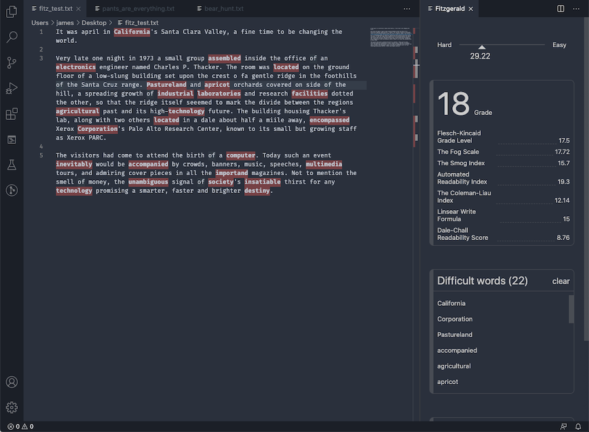

# fitzgerald README

Fitzgerald is a Visual Studio Code extension that will analyse an active text document according to several readability metrics.

## Features

Fitz uses the text-readability package to analyse the currently active text document and display an ease of reading score, a "Grade" score, a list of difficult words in the text and several other statistics. 

## Running the extension

Fitz only depends on the [text-readability](https://github.com/clearnote01/readability) package. Just `npm install` in the top level directory to install it.

The simplest way to run the extension is simply to open the top level directory in VSC and hit "debug". This should open an extension development host that has the extension installed.

To run the extension issue the command `Fitz` from the command palette. This should open a window displaying statistics for the current text file. The display will automatically update when you alter the text, make a selection or change editor windows.  

## Known Issues

- Difficult word highlights will not be displayed correctly when there are multiple selections.
- Testing is non-existent.

## Fitzgerald?

After F. Scott Fitzgerald. The extension is partially inspired by [the Hemmingway editor][http://www.hemingwayapp.com] so the name was chosen to keep the "lost generation" theme going. 